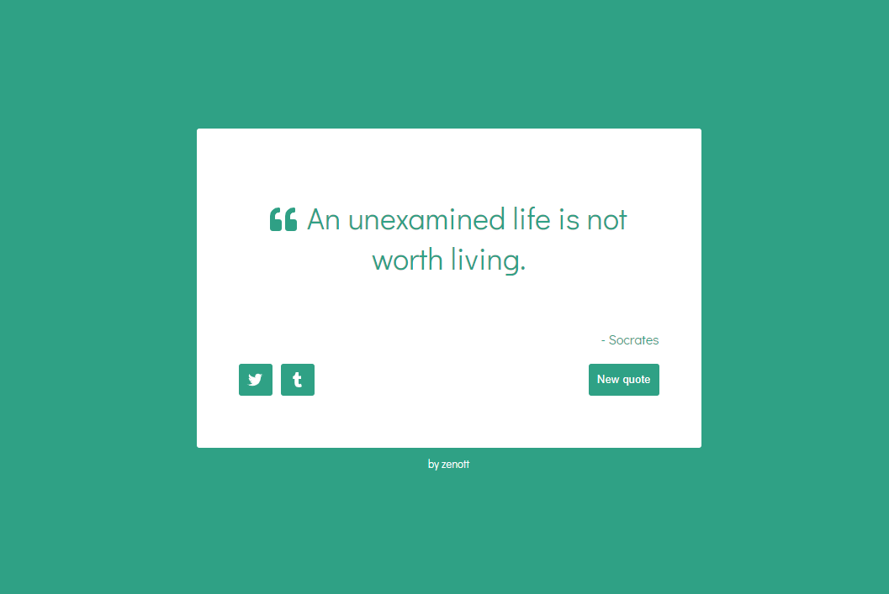

## Random Quote Machine

> Random quote machine web app built with React.



## Live Demo

[Demo Link](https://balintmendli.github.io/random-quote-machine/)

## Built With

- React.js
- CSS 3
- Tests with Jest / Enzyme

## Usage

### Prerequisites

- node
- npm

### Getting started

Clone the repository to your local machine

```
$ git clone https://github.com/BalintMendli/random-quote-machine.git
```

Change into the project directory

```
$ cd random-quote-machine
```

Install dependencies

```
$ npm install
```

Start development server

```
$ npm run start
```

### Run the test suite

```
$ npm run test
```

## Author

👤 **Balint Mendli**

- GitHub: [@BalintMendli](https://github.com/BalintMendli)
- Website: [mendli.com](https://mendli.com)
- Email: [balint@mendli.com](mailto:balint@mendli.com)

## 🤝 Contributing

Contributions, issues, and feature requests are welcome!
Feel free to check the [issues page](https://github.com/BalintMendli/random-quote-machine/issues/).

1. Fork it
2. Create your working branch

```
git checkout -b my-new-feature
```

3. Commit your changes

```
git commit -am 'Add some feature'
```

4. Push to the branch

```
git push origin my-new-feature
```

5. Create a new Pull Request

## Show your support

Give a ⭐️ if you like this project!

## Acknowledgments

- [React Helmet](https://github.com/nfl/react-helmet)
- [Font Awesome 5 Icons](https://fontawesome.com/)

## 📝 License

This project is [MIT](LICENSE.md) licensed.
